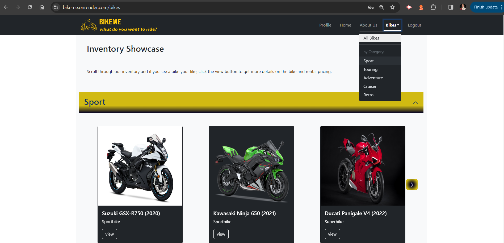
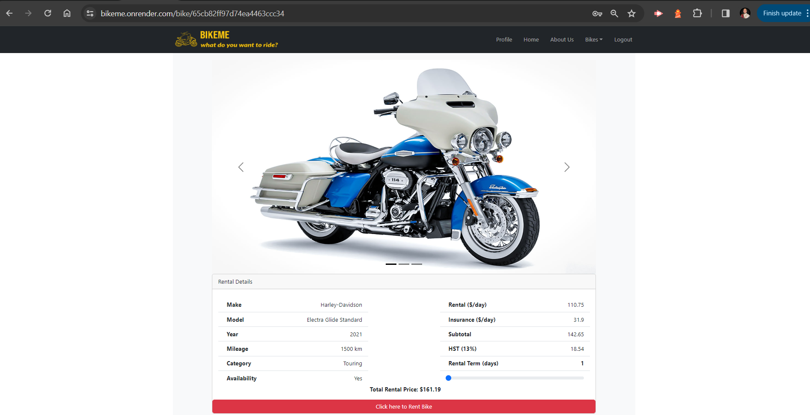

# BikeME
## Description
BikeME is a one-stop motorcycle rental site in the GTA. Whether you are looking for a sporty ride or a relaxing cruiser, we have a bike for you! 

## Table of Contents
1. [Installation](#installation)
2. [Usage](#usage)
3. [License](#license)
4. [Contribution](#contribution)
5. [Tests](#tests)
6. [Questions](#questions)
7. [Screenshots](#screenshots)
8. [Links](#links)

## Installation
To install and run BikeME locally, follow these steps:

1. Clone the GitHub repository to your local machine:
git clone https://github.com/Levi-Man/bikeME.git
2. Navigate to the project directory: cd bikeME
3. Install the dependencies:
npm install

## Usage
To start the application, run the following command in the project directory:
npm start
Once the server is running, you can access the application in your web browser at `http://localhost:3000`.

## License
This project is protected under the MIT license.

## Contribution
Fork the repo and send a pull request.

## Tests
Testing is currently being developed.

## Questions
GitHub: 

Indra Manahan - [Levi-Man](https://github.com/Levi-Man)

Syed Kazmi- [Kazmiali123](https://github.com/kazmiali123)

Blessing Okeme - [Blessing-o](https://github.com/blessing-o)

For any questions or suggestions, please reach us at the following: 

Indra Manahan- indra.levi.manahan@gmail.com

Syed Kazmi - kazmiali123@gmail.com

Blessing Okeme- blessing.okeme@outlook.com

## Screenshots
Homepage

Login

All Bikes Page

Single Bike

## Links

Deployed site: https://bikeme.onrender.com/

GitHub Repo: https://github.com/Levi-Man/bikeME

